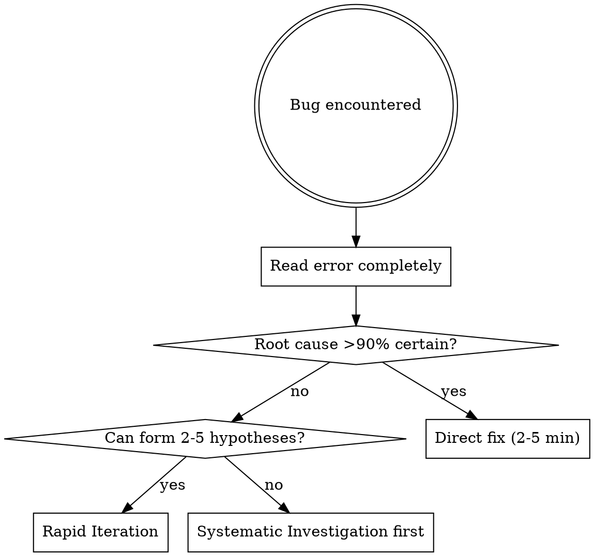

# AI-Powered Debugging with Rapid Iteration

## Overview

**Traditional debugging:** Minimize fix attempts by investigating thoroughly first.
**AI-powered debugging:** Cheap iteration beats expensive investigation.

**Core principle:** When root cause is uncertain, generate hypotheses and test them rapidly in isolated environments. Each failed attempt eliminates possibilities faster than deep analysis.

## When to Use

Use for ANY bug, error, test failure, or unexpected behavior.

## The Decision Framework



### Certainty Assessment (30 seconds)

**High Certainty (>90%) → Direct Fix:**
- Error message states exact problem: "Cannot find module 'X'"
- Stack trace points to obvious issue
- Recent change clearly broke it
- You've seen this exact error before

**Examples of >90% certain bugs:**
```
✅ "Module 'express' not found" → Missing dependency, run npm install
✅ "SyntaxError: Unexpected token" at line 42 → Typo in code
✅ "Port 3000 already in use" → Process running, kill it
✅ "Cannot read property 'x' of null" with obvious null → Add null check
```

**NOT >90% certain (don't skip to direct fix):**
```
❌ "Cannot read property 'x' of undefined" (unknown what's undefined) → 40-80%
❌ Intermittent failures → 40-80%
❌ "It doesn't work" → 40-80%
```

**Low-Medium Certainty (40-80%, can form 2-5 hypotheses) → Rapid Iteration:**
- Intermittent failures (timing/race conditions)
- "It doesn't work" with vague symptoms
- Multiple things could cause this
- Timing-dependent or environment-dependent
- Integration issues (API, database, external service)

**Very Low Certainty (<40%, no pattern match) → Systematic First:**
- Novel/exotic issue you've never seen
- Can't generate plausible hypotheses
- Random crashes with no error messages
- Need evidence to form hypotheses
- Use systematic-debugging to gather evidence → THEN rapid iteration

## Phase 0: High-Quality Hypothesis Generation

**CRITICAL:** Hypothesis quality determines iteration efficiency.

**Time budget: 5-10 minutes maximum**

### Evidence Gathering

**1. Read Error Completely (1 min)**
```
- Full stack trace (not just first line)
- Error codes, line numbers, file paths
- Warnings before the error
```

**2. Code Context (2-3 min)**
```
- Read failing function/module
- Check dependencies and callers
- Scan recent changes: git log --oneline -10
```

**3. Known Issues Check (2-3 min)**
```
- Library/framework docs for this error
- GitHub issues: "[library name] [exact error message]"
- Stack Overflow search
- Release notes if recent upgrade
```

**4. Working Comparisons (1-2 min)**
```
- Find similar working code in codebase
- What's different between working and broken?
```

### Generate Ranked Hypotheses

**Hypothesis Count Rules:**
- **Minimum:** 2 hypotheses (if only 1, reconsider - might be >90% certain, skip to direct fix)
- **Maximum:** 5 hypotheses (if you can think of 10+, you need to gather more evidence first)
- **Sweet spot:** 3-4 hypotheses ranked by probability

**Format (REQUIRED):**
```
1. [Hypothesis] (X% probability)
   Evidence: [why you think this]
   Quick test: [3-min validation approach]
   If confirmed: [30-sec fix description]

2. [Hypothesis] (Y% probability)
   Evidence: [why you think this]
   Quick test: [3-min validation approach]
   If confirmed: [30-sec fix description]

[Continue for 2-5 hypotheses total, ranked by probability]
```

**Example - Intermittent CI Failure:**
```
1. Race condition in parallel tests (60%)
   Evidence: Fails only on CI with --maxWorkers=4, passes locally
   Quick test: Run with --maxWorkers=1, check for shared state
   If confirmed: Add test isolation or unique test data

2. Environment variable difference (25%)
   Evidence: CI config may differ from local
   Quick test: Log process.env in test, compare CI vs local
   If confirmed: Update CI env vars or fix env-dependent code

3. Timing/async issue (15%)
   Evidence: Intermittent = timing-sensitive
   Quick test: Add delays, check for missing awaits
   If confirmed: Fix async handling
```

## Phase 1: Rapid Iteration Setup

### 1.1: Ensure Clean Workspace

```bash
# Commit or stash current work
git status
git stash  # if needed

# Verify main branch clean
git checkout main
```

**Why:** Worktrees require clean base for isolation.

### 1.2: Plan Log Visibility

Determine how you'll observe results:
- **Tests:** Capture stdout/stderr, read full output
- **Server:** Run with DEBUG=* or LOG_LEVEL=debug
- **Application:** Add strategic console.log at hypothesis points

## Phase 2: Rapid Iteration Loop

**REQUIRED: Use worktrees for every hypothesis test**

**Why worktrees are mandatory:**
```
Without worktree (pollutes main workspace):
- Make change: 1 min
- Test: 2 min  
- Failed? Undo carefully: 2 min
- Repeat 5x = 25 min + dirty workspace + mental overhead

With worktree (clean isolation):
- Create worktree: 10 sec
- Make change: 1 min
- Test: 2 min
- Failed? Remove worktree: 5 sec
- Repeat 5x = 13 min, clean workspace, clear mind

Worktrees save ~12 minutes AND eliminate cleanup anxiety.
Even under time pressure, worktrees are FASTER.
```

**Time per hypothesis: 3-5 minutes maximum**

### For Each Hypothesis (Highest Probability First):

**2.1: Create Isolated Environment**
```bash
# Use EnterWorktree tool
EnterWorktree(name: "test-hypothesis-[N]")

# Or manual:
git worktree add ../test-hypothesis-[N] -b test-hypothesis-[N]
cd ../test-hypothesis-[N]
```

**2.2: Implement Minimal Fix (30-60 seconds)**
```
- Add strategic debug logs if needed
- Implement the smallest change to test hypothesis
- Don't fix multiple things at once
```

**2.3: Test and Observe (2-3 minutes)**
```bash
# For deterministic bugs
npm test 2>&1 | tee test.log

# For intermittent bugs  
for i in {1..10}; do npm test || echo "FAIL $i"; done

# Read logs completely
cat test.log
```

**2.4: Evaluate Result**
- **✅ FIXED** (passes 10/10 if intermittent, or deterministic pass)
  → Root cause found! Keep worktree, proceed to Phase 3
  
- **❌ STILL FAILS** (same failure pattern)
  → Hypothesis eliminated
  → Exit worktree with remove
  → Update probabilities for remaining hypotheses
  
- **⚠️ IMPROVED** (was 50% fail → 10% fail - partial fix)
  → **Combination bug detected!** Multiple root causes exist
  → **KEEP this worktree** (don't remove - partial fix is valuable)
  → Note the improvement and which hypothesis helped
  → Continue testing remaining hypotheses in NEW worktrees
  → After all tests complete, you may need to merge MULTIPLE fixes
  
  **Example combination bug:**
  ```
  Hypothesis 1 (race condition fix): 50% fail → 10% fail ⚠️
  Hypothesis 2 (async timing fix): 10% fail → 0% fail ✅
  Final solution: Merge BOTH fixes (hypothesis 1 + hypothesis 2)
  ```

**2.5: Exit Failed Worktree**
```bash
# Return to main workspace
# Return to main workspace
cd -

# Remove failed attempt
ExitWorktree(action: "remove", discard_changes: true)

# Or manual:
git worktree remove ../test-hypothesis-[N]
```

### Stop Condition: 5 Attempts Failed

**If 5+ fix attempts tested and all failed:**
→ STOP rapid iteration
→ Switch to systematic-debugging
→ Gather deeper evidence
→ Return to rapid iteration with new hypotheses

**Clarification:** "5 attempts" means 5 different FIXES you tested, not necessarily 5 distinct hypotheses.
- If you have 3 hypotheses but all fail → that's only 3 attempts, you can continue
- If you have 2 hypotheses but try variations 5 times → that's 5 attempts, STOP
- If you have 6 hypotheses → reduce to top 5 before starting

**Why:** 5 failures = your hypotheses are wrong, need different strategy (systematic evidence gathering).

## Phase 3: Completion

### If Fixed:

**3.1: Clean Up Debug Logs**
```
- Remove temporary console.log statements
- Remove diagnostic instrumentation
- Keep only essential logging
```

**3.2: Merge Successful Fix**
```bash
# From main workspace
# Return to main workspace
cd -

# Merge the successful worktree branch
git merge test-hypothesis-[N]

# Clean up worktree
ExitWorktree(action: "remove")
# Or manual:
git worktree remove ../test-hypothesis-[N]
git branch -d test-hypothesis-[N]
```

**3.3: Verify and Document**
```bash
# Run full test suite
npm test

# Document root cause in commit
git commit -m "fix: [description]

Root cause: [what actually caused the bug]
Solution: [what fixed it]
Tested: [how verified]"
```

**3.4: Add Regression Test**
- If bug was subtle, add test to prevent recurrence
- Especially for race conditions, timing issues

### If All Attempts Failed:

```
Switch to systematic-debugging:
- Your hypotheses were wrong
- Need deeper investigation
- Gather more evidence
- Form new hypotheses based on evidence
```

## Key Principles

### 1. Iteration Economics

**Traditional mindset:**
```
Investigation: 60 min → Fix: 5 min → Total: 65 min
```

**AI mindset:**
```
Hypothesis 1: 3 min → FAIL
Hypothesis 2: 3 min → FAIL
Hypothesis 3: 3 min → FAIL
Hypothesis 4: 3 min → SUCCESS
Total: 12 min
```

**AI wins when: (num_hypotheses × 3 min) < investigation_time**

### 2. Failed Attempts Are Information

**Traditional:** Failed fix = wasted time (BAD)
**AI-powered:** Failed fix = eliminated hypothesis (GOOD)

Each failure narrows the search space.

### 3. Worktrees Are Mandatory

**Why:**
- Keeps main workspace clean
- Easy to abandon failed attempts
- Can test multiple hypotheses in parallel
- No pollution from failed experiments

**No exceptions:** Every hypothesis test uses worktree.

### 4. Bayesian Updating

After each failed test:
```
1. Eliminate refuted hypothesis
2. Update probabilities for remaining hypotheses
3. Consider: did failure reveal NEW hypothesis?
4. Re-rank and continue
```

## Red Flags - STOP and Recalibrate

If you catch yourself thinking:
- "Let me investigate thoroughly first" (30+ min investigation)
- "I'll test this in main workspace" (no worktree)
- Testing hypothesis 6, 7, 8... without switching strategies
- "Just one more quick fix" (after 5 failures)
- Creating 10+ hypotheses (too many = can't form good hypotheses)
- Treating obvious bug as uncertain (missing dependency doesn't need 5 hypotheses)
- "I'm 80% sure" (80% is NOT >90%, use rapid iteration)
- "This fix is only one line, too simple for worktrees" (worktrees are for isolation, not complexity)

**ALL of these mean: Re-read this skill and correct course.**

### Recovery: "I Already Started Without This Skill"

If you already made changes in main workspace before using this skill:

1. **STOP immediately** - Don't make more changes
2. **Review what you tried:** `git diff`
3. **Save your attempt:** `git stash`  
4. **Review your stashed changes:** `git stash show -p`
5. **NOW use the skill properly** with worktrees
6. **Your stashed attempt informs hypothesis generation** - you already tested one hypothesis!

## Common Rationalizations

| Excuse | Reality |
|--------|---------|
| "Investigation first is safer" | 5 quick tests (15 min) beats 60 min investigation |
| "Worktree is overkill for simple test" | Worktree takes 10 seconds, cleanup takes 5 min without it |
| "I'm 80% sure, let me test in main" | That's why worktrees exist—test safely |
| "One more attempt won't hurt" (after 5) | 6th attempt = same strategy expecting different result |
| "Too simple for worktrees" | Simple fixes fail too—use worktrees always |
| "Need more evidence before attempting" | Attempt IS evidence gathering when iteration is cheap |

## Examples by Certainty Level

### High Certainty: Direct Fix

**Error:** `Cannot find module 'express'`
```
Assessment: 100% certain—missing dependency
Action: npm install express (no hypotheses needed)
Time: 2 min
```

### Low Certainty: Rapid Iteration

**Error:** Test fails 30% on CI, 0% locally
```
Assessment: Multiple plausible causes
Hypotheses:
1. Race condition (60%)
2. Env vars (25%)
3. Timing (15%)

Iteration:
- Hypothesis 1: 3 min → Still fails
- Hypothesis 2: 3 min → Still fails
- Hypothesis 3: 3 min → FIXED
Time: 9 min total
```

### Very Low Certainty: Systematic Then Iterate

**Error:** Application crashes randomly, no logs
```
Assessment: Can't form plausible hypotheses
Action:
1. Use systematic-debugging to gather evidence (30 min)
2. Evidence reveals: memory leak in native module
3. NOW form hypotheses about the leak
4. Use rapid iteration to test leak fixes
Time: 45 min (but necessary for novel issue)
```

## When to Use This Skill

**Use for:**
- Implementation bugs during development
- Test failures (unit, integration, e2e)
- Tooling or environment issues
- Any unexpected behavior or errors
- Performance issues with multiple possible causes

**NOT for:**
- Requirements clarification (gather requirements first)
- Design decisions (design before debugging)
- Code review findings (those are known issues, not bugs to debug)

## Related Skills

- **systematic-debugging:** Use when rapid iteration fails (5+ attempts)
- **superpowers:using-git-worktrees:** Full worktree workflow details
- **superpowers:test-driven-development:** For adding regression tests after fix
