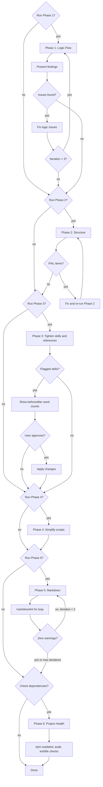
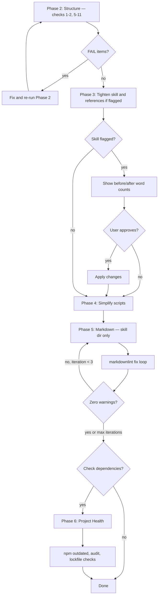

# Lint Process Diagrams

## All skills mode

```mermaid
graph TD
    Q1{Run Phase 1?} -->|yes| D[Phase 1: Logic Flow]
    Q1 -->|no| Q2
    D --> E[Present findings]
    E --> F{Issues found?}
    F -->|yes| F2[Fix logic issues]
    F2 --> F3{Iteration < 3?}
    F3 -->|yes| D
    F3 -->|no| Q2
    F -->|no| Q2
    Q2{Run Phase 2?} -->|yes| A[Phase 2: Structure]
    Q2 -->|no| Q3
    A --> B{FAIL items?}
    B -->|yes| C[Fix and re-run Phase 2]
    B -->|no| Q3
    C --> A
    Q3{Run Phase 3?} -->|yes| G1[Phase 3: Tighten skills and references]
    Q3 -->|no| Q4
    G1 --> G2{Flagged skills?}
    G2 -->|yes| G3[Show before/after word counts]
    G3 --> G4{User approves?}
    G4 -->|yes| G5[Apply changes]
    G4 -->|no| Q4
    G5 --> Q4
    G2 -->|no| Q4
    Q4{Run Phase 4?} -->|yes| H[Phase 4: Simplify scripts]
    Q4 -->|no| Q5
    H --> Q5
    Q5{Run Phase 5?} -->|yes| I[Phase 5: Markdown]
    Q5 -->|no| Q6
    I --> J[markdownlint fix loop]
    J --> K{Zero warnings?}
    K -->|no, iteration < 3| I
    K -->|yes or max iterations| Q6
    Q6{Check dependencies?} -->|yes| M[Phase 6: Project Health]
    Q6 -->|no| L[Done]
    M --> N[npm outdated, audit, lockfile checks]
    N --> L[Done]
```

## Single skill mode

```mermaid
graph TD
    A[Phase 2: Structure — checks 1-2, 5-11] --> B{FAIL items?}
    B -->|yes| C[Fix and re-run Phase 2]
    C --> A
    B -->|no| G1[Phase 3: Tighten skill and references if flagged]
    G1 --> G2{Skill flagged?}
    G2 -->|yes| G3[Show before/after word counts]
    G3 --> G4{User approves?}
    G4 -->|yes| G5[Apply changes]
    G4 -->|no| H
    G5 --> H
    G2 -->|no| H[Phase 4: Simplify scripts]
    H --> I[Phase 5: Markdown — skill dir only]
    I --> J[markdownlint fix loop]
    J --> K{Zero warnings?}
    K -->|no, iteration < 3| I
    K -->|yes or max iterations| Q6{Check dependencies?}
    Q6 -->|yes| M[Phase 6: Project Health]
    Q6 -->|no| L[Done]
    M --> N[npm outdated, audit, lockfile checks]
    N --> L[Done]
```
